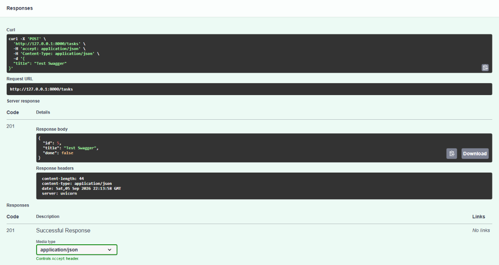

# ✦ SORTED.

> A quiet, considered to-do list — built as a FastAPI CRUD API, with a small browser space for the things that matter.

**SORTED.** is a Week 2 backend assignment for **FlyRank AI**. At its heart is a deliberately small, in-memory Task API: it can create, read, update, and delete tasks. A lightweight beige, brown, and black dashboard sits on top, so the same API can also be useful in daily life.

It was built to make the request → response loop feel tangible: one task, one endpoint, one clear answer at a time.

---

## ✦ Highlights

- ✅ **Complete CRUD API** — create, list, read, update, and delete tasks
- 🐍 **Python + FastAPI** — an approachable backend framework with automatic docs
- 📚 **Swagger UI** — interactive API documentation and testing at `/docs`
- 🧠 **In-memory storage only** — exactly as required for Week 2; no database or files
- 🎨 **SORTED. dashboard** — a responsive personal task interface at `/app`
- ✓ **Completion checkmarks** — mark a task as done through the real `PUT` endpoint
- 🧪 **curl-testable** — every core endpoint can be tested from the terminal

---

## 🛠️ Built With

- **Python 3.10+** — programming language
- **FastAPI** — API framework
- **Uvicorn** — local development server
- **HTML, CSS, and JavaScript** — the small SORTED. dashboard

---

## ⚙️ Getting Started

1. Clone the repository and enter the project folder.

   ```bash
   git clone <this-repository-url>
   cd sorted-fastapi-crud
   ```

2. Create and activate a virtual environment.

   ```powershell
   py -m venv .venv
   .\.venv\Scripts\Activate.ps1
   ```

3. Install the project packages.

   ```powershell
   pip install -r requirements.txt
   ```

4. Start the local server.

   ```powershell
   uvicorn main:app --reload
   ```

5. Visit these local addresses.

   - Required API front door: `http://127.0.0.1:8000/`
   - SORTED. dashboard: `http://127.0.0.1:8000/app`
   - Swagger UI: `http://127.0.0.1:8000/docs`
   - Health check: `http://127.0.0.1:8000/health`

Stop the server with `Ctrl + C`. Restarting it returns the list to its three original tasks.

---

## 🔗 API Endpoints

| Method | Path | What it does | Success |
| --- | --- | --- | --- |
| `GET` | `/` | Describes the API | `200` + API JSON |
| `GET` | `/health` | Checks that the server is alive | `200` + `{"status":"ok"}` |
| `GET` | `/tasks` | Returns every task | `200` + task list |
| `GET` | `/tasks/{id}` | Returns one task | `200` + task |
| `POST` | `/tasks` | Creates a task | `201` + created task |
| `PUT` | `/tasks/{id}` | Changes a task's title, done status, or both | `200` + updated task |
| `DELETE` | `/tasks/{id}` | Removes a task | `204 No Content` |

When an ID does not exist, the API returns `404` with a clear JSON response:

```json
{ "error": "Task 99 not found" }
```

### Request examples

Create a task:

```json
{ "title": "Send the Week 2 assignment" }
```

Mark task 1 as complete:

```json
{ "done": true }
```

---

## 🧪 Testing with curl

With the server running, open a second terminal and run:

```powershell
curl.exe -i http://127.0.0.1:8000/tasks
```

Example output:

```text
HTTP/1.1 200 OK
content-type: application/json

[
  {"title":"Plan the week","done":false,"id":1},
  {"title":"Finish FastAPI assignment","done":false,"id":2},
  {"title":"Take an evening walk","done":true,"id":3}
]
```

For a `POST` or `PUT` request in Windows PowerShell, put the JSON body in a small temporary file first. For example, create `create-task.json` containing:

```json
{ "title": "Practice CRUD" }
```

Then create the task with curl:

```powershell
curl.exe -i -X POST http://127.0.0.1:8000/tasks -H "Content-Type: application/json" --data-binary "@create-task.json"
```

Delete the temporary JSON file after testing; it is not part of the project.

---

## 📚 Swagger UI

FastAPI automatically provides interactive API documentation at:

```text
http://127.0.0.1:8000/docs
```

Use **Try it out** and **Execute** to create, read, update, and delete a task through the browser.

### Swagger screenshot

After testing a successful endpoint in Swagger, save a screenshot as `docs/swagger-screenshot.png`, then replace the line below with the image Markdown.



---

## 📁 Project Structure

```text
├── static/
│   ├── index.html       # SORTED. dashboard structure
│   ├── styles.css       # Beige, brown, and black responsive styling
│   └── app.js           # Frontend requests to the FastAPI CRUD endpoints
├── main.py              # Models, seed tasks, routes, validation, and error handling
├── requirements.txt     # FastAPI and Uvicorn
├── .gitignore
└── README.md
```

---

## 🎯 What I Learned

- Mapping CRUD actions to `POST`, `GET`, `PUT`, and `DELETE`
- Returning the correct HTTP statuses: `200`, `201`, `204`, `400`, and `404`
- Writing server-side validation instead of trusting user input
- Using Swagger UI to document and test an API
- Keeping data in memory and understanding why it resets after a restart
- Connecting a simple frontend to a backend API using `fetch`

---

## 🕯️ The Mortality Experiment

I created tasks, stopped the server, and started it again. The added tasks disappeared and the three seed tasks returned because the task list exists only in the server's memory; when the server stops, that memory is cleared.

This is intentional. Week 2 is about learning CRUD before adding a database in a later week.

---

## Note

SORTED. is an academic project designed to run locally. It does not use a database, accounts, authentication, or cloud deployment, because those would distract from the Week 2 CRUD API learning goal.

## License

Open for learning purposes. Feel free to fork, study, and build on it.
